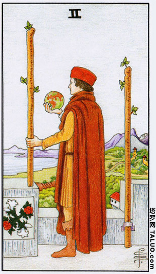

# 权杖2

## 基本元素和内涵:
星球（掌控、领导力）、上位者（孤独、自负）、望远（代表远见）

## 正逆位
| 正位 | 逆位 |
|---|---|
|好的领导者要能够提出方向和愿景，同时约束自己对于权利的欲望。这张牌常常意味着面临重要的选择，不知道该如何进一步发展，或者守住现在已有的成果，因而陷入两难的书面。花更多的时间把问题彻底研究，做好各种方案和准备，等待时机出现再行动。|行动力是成功的不二法门，任何事情没有实际去作都只是空谈，下定决心之后就应该要把理念落实到实际生活中。当这张牌出现时可以发挥你个人的魅力，用个人化的方式去解决问题，虽然不是制式的方法，也许会有意想不到的效果。|

## 性格特质
高瞻远瞩、但容易忽略眼前的一些事情（忽略了背后的另一根权杖），有点虚  
## 情感方面
会有主导意愿、或适合主导